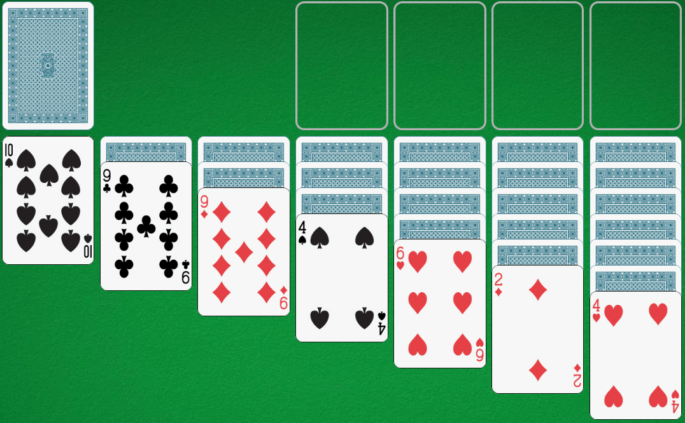
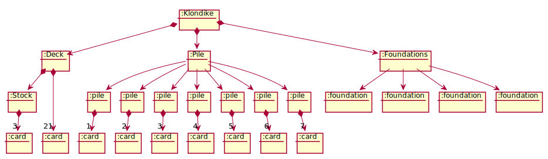
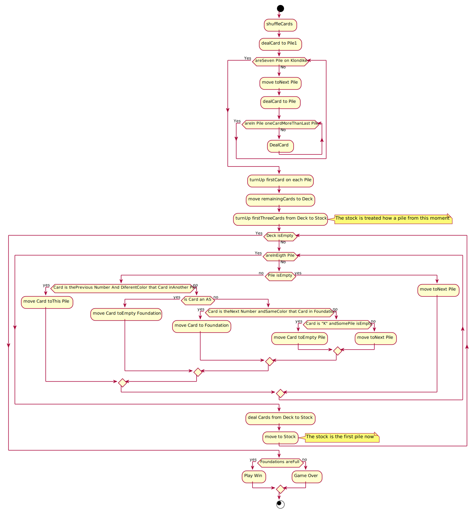

# Diagramas Klondike
Universidad Politecnica Salesiana  

- [aperezm1@est.ups.edu.ec](mailto:aperezm1@est.ups.edu.ec)

- [bpinos@est.ups.edu.ec](mailto:bpinos@est.ups.edu.ec)

- [ptorresp1@est.ups.edu.ec](mailto:ptorresp1@est.ups.edu.ec)

---

## index

* [Domain Model](#domain-model)  
    * [Vocabulary](#vocabulary)
    * [Estado Inicial](#estado-inicial)  
    * [Estado movimiento de carta](#estado-movimiento-de-carta)
    * [Diagra de actividades](#diagra-de-actividades)

- [Modelo de vistas de caso de uso](#modelo-de-vistas-de-caso-de-uso)
    * [Diagrama de actores y casos de uso](#diagrama-de-actores-y-casos-de-uso)  
    * [Diagrama relacion de casos de uso](#diagrama-relacion-de-casos-de-uso)
    * [CU Shuffle](#cu-shuffle)
    * [CU DealPile](#cu-dealpile)
    * [CU DealStock](#cu-dealstock)
    * [CU MoveCard](#cu-movecard)
    * [CU MovePile](#cu-movepile)
    * [CU ResetDeck](#cu-resetdeck)

* [Diagrama de analisis](#diagrama-de-analisis)
    * [Arquitectura MVC paquetes](#arquitectura-mvc-paquetes)

---

## Domain Model  

[WIKI](https://en.wikipedia.org/wiki/Klondike_(solitaire))

  

### Vocabulary

  
  

### Estado Inicial
  
  

### Estado movimiento de carta 

* Objetivo TicTacToe en 3ª fila

  

### Diagra de actividades

  

---

## Modelo de vistas de caso de uso

### Diagrama de actores y casos de uso

### Diagrama relacion de casos de uso

### CU Shuffle

### CU DealPile

### CU DealStock

### CU MoveCard

### CU MovePile

### CU ResetDec

---

## Diagrama de analisis  
### Arquitectura MVC paquetes

  
